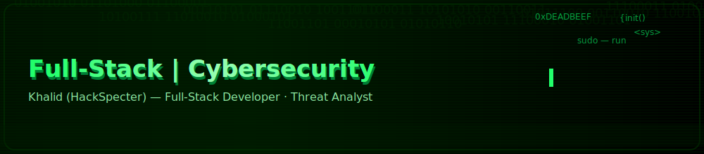

# 👋 Привет, я Khalid (HackSpecter)

💻 Full-Stack Developer | Cybersecurity Enthusiast  

---

## 🚀 Обо мне
- 🔐 Интересуюсь кибербезопасностью и анализом угроз  
- ⚡ Разрабатываю веб-приложения, ботов и CRM-системы  
- 🌍 Открыт для коллабораций в международных проектах  
- 📚 Постоянно учусь и расширяю стек технологий  

---

## 🛠️ Технологии и инструменты

---

## 📊 GitHub статистика

---

## 📫 Контакты
- Telegram: [@pythonixx](https://t.me/pythonixx)  
- Email: *pythonist7@gmail.com*   

---

⭐️ Подписывайтесь, чтобы следить за моими проектами!
